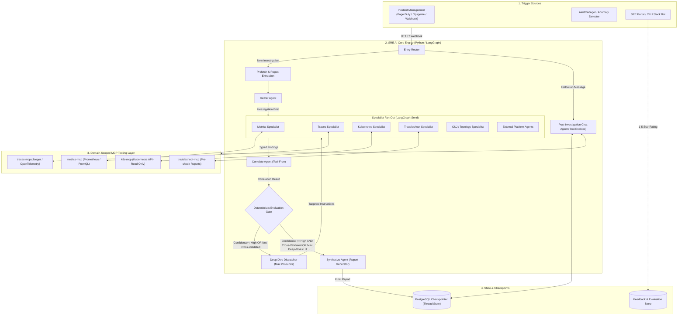

# High-Level Architecture: Shepherd

## 1. System Overview

Shepherd is an automated root-cause analysis (RCA) and troubleshooting platform designed to investigate production incidents, correlate cross-domain telemetry, and produce structured incident reports without human intervention. Once an investigation is complete, it transitions into an interactive post-investigation assistant.

The system is **not a Kubernetes Operator** (it does not manage custom resource definitions or execute mutating reconciliation loops). Instead, it runs as a containerized service (FastAPI application + background async workers) with read-only access to external observability backends and infrastructure APIs.

---

## 2. Key Components & Responsibilities

| Component | Responsibility | Tool Access |
|---|---|---|
| **Entry Router** | Inspects thread ID and determines whether to start a new investigation or route to existing post-investigation chat. | No |
| **Gather Agent & Prefetch** | Extracts incident/troubleshooting IDs via regex, prefetches initial summaries, and outputs an `InvestigationBrief`. | Prefetch MCPs only |
| **Specialist Agents** | Domain-isolated investigators running a 10-15 turn tool loop followed by structured Pydantic extraction. | Domain-scoped MCP |
| **Correlate Agent** | Cross-references findings across independent specialists to filter false-positive noise and confirm root-cause convergence. | **None (Zero Tool Access)** |
| **Evaluation Gate** | Pure deterministic Python function applying cross-validation rules and bounding deep dives to $\le 2$ rounds. | **None** |
| **Deep Dive Agent** | Generates targeted follow-up questions for named specialists to fill specific evidence gaps. | **None** |
| **Synthesize Agent** | Assembles the final structured incident report with timeline, evidence chain, and actionable recommendations. | **None** |
| **Chat Agent** | Allows SRE engineers to interrogate the investigation report, re-run specialists, or perform live checks. | Full Telemetry MCPs |

---

## 3. Telemetry & Data Boundaries

- **Kubernetes Access:** Restricted to read-only API permissions (`get`, `list`, `watch` on Pods, Nodes, Events, Deployments, StatefulSets, HPAs, and ResourceMetrics).
- **Metrics Access:** Scoped PromQL queries against Prometheus / Thanos / VictoriaMetrics with per-query time bounds.
- **Trace Access:** Span filtering against Jaeger / OpenTelemetry collectors matching affected service namespaces and time windows.
- **Markdown Optimization:** All MCP endpoints format results in dense, structured Markdown rather than raw verbose JSON, reducing token consumption by ~40%.
