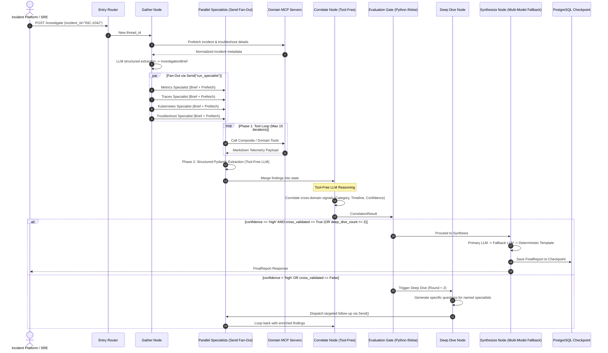
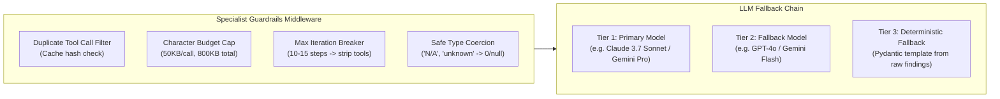
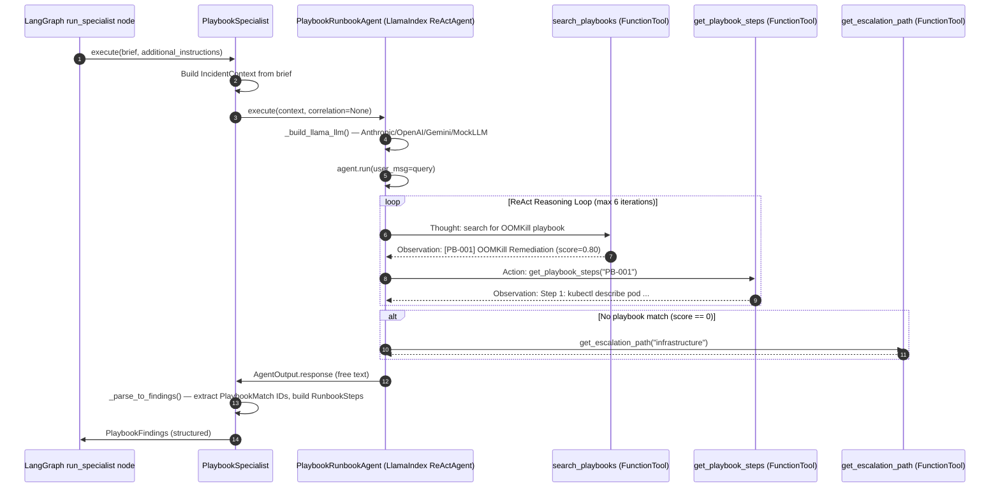

# Low-Level Architecture & Technical Specification

## 1. LangGraph State Schema & Reducers

LangGraph state is shared across parallel nodes via custom reducers to prevent `InvalidUpdateError` during parallel fan-out (`Send()`).

```mermaid
    class InvestigationState {
        +str investigation_id
        +InvestigationType investigation_type
        +str raw_input
        +IncidentContext incident_context
        +InvestigationBrief investigation_brief
        +dict findings_by_domain
        +CorrelationResult correlation_result
        +int deep_dive_count
        +list[DeepDiveTask] suggested_deep_dives
        +FinalReport final_report
        +list[dict] chat_history
        +str current_phase
    }

    class MetricsFindings {
        +str service_name
        +float error_rate_pct
        +float p99_latency_ms
        +list[str] anomalous_metrics
        +list[str] evidence_urls
    }

    class TraceFindings {
        +list[str] failing_spans
        +str root_span_service
        +str root_error_message
        +float avg_duration_ms
    }

    class KubernetesFindings {
        +list[str] oom_killed_pods
        +list[str] restarting_pods
        +list[str] unhealthy_nodes
        +list[str] warning_events
    }

    class PlaybookFindings {
        +str incident_summary
        +list[PlaybookMatch] matched_playbooks
        +PlaybookMatch recommended_runbook
        +list[str] escalation_path
        +list[str] notes
    }

    class PlaybookMatch {
        +str playbook_id
        +str title
        +float relevance_score
        +str summary
        +list[RunbookStep] applicable_steps
    }

    class RunbookStep {
        +int step_number
        +str action
        +str command
        +str expected_outcome
        +str rollback
    }

    class CorrelationResult {
        +str root_cause_summary
        +RootCauseCategory category
        +float confidence_score
        +bool cross_validated
        +list[str] validated_by_specialists
        +list[TimelineEvent] timeline
        +list[str] contributing_factors
    }

    InvestigationState *-- MetricsFindings
    InvestigationState *-- TraceFindings
    InvestigationState *-- KubernetesFindings
    InvestigationState *-- PlaybookFindings
    InvestigationState *-- CorrelationResult
    PlaybookFindings *-- PlaybookMatch
    PlaybookMatch *-- RunbookStep

### LangGraph State Reducer Definition

```python
from typing import Annotated, Any, TypedDict

def last_non_none(current: Any, update: Any) -> Any:
    """Last-writer-wins reducer for parallel specialist state keys."""
    return update if update is not None else current

def merge_dict_reducer(
    current: dict[str, Any] | None,
    update: dict[str, Any] | None,
) -> dict[str, Any]:
    """Merges parallel specialist findings into a combined dict."""
    result = dict(current or {})
    if update:
        result.update(update)
    return result

class InvestigationState(TypedDict):
    investigation_id: str
    investigation_type: str
    raw_input: str
    incident_context: Annotated[dict | None, last_non_none]
    investigation_brief: Annotated[dict | None, last_non_none]
    prefetched_data: Annotated[dict[str, str], merge_dict_reducer]
    # All domain findings keyed by specialist name (metrics, traces, k8s,
    # troubleshoot, playbook, …) are merged here by parallel Send() nodes.
    findings_by_domain: Annotated[dict[str, Any], merge_dict_reducer]
    correlation_result: Annotated[dict | None, last_non_none]
    evaluation_result: Annotated[dict | None, last_non_none]
    deep_dive_count: Annotated[int, last_non_none]
    suggested_deep_dives: Annotated[list[dict[str, Any]], last_non_none]
    final_report: Annotated[dict | None, last_non_none]
    chat_history: Annotated[list[dict[str, str]], last_non_none]
    current_phase: Annotated[str, last_non_none]
```

---

## 2. Detailed Execution Sequence & Node Logic



---

## 3. Production Hardening Mechanisms



1. **Duplicate Tool Call Filter:** Computes SHA-256 of `(tool_name, sorted_json_args)`. If re-issued, immediately returns: `"Error: Duplicate call suppressed. Refer to prior result."`
2. **Character Budget:** Per-result cap of 50,000 characters; cumulative session cap of 800,000 characters. When exceeded, tool bindings are removed, forcing immediate conclusion.
3. **Safe Coercion Validators:** Pydantic models use `@field_validator(mode="before")` on float/integer fields to safely map `"<UNKNOWN>"`, `"-"`, `"N/A"` to `0` or `None`.
4. **Three-Way Race Cancellation:** Every async node execution races against an `asyncio.Event` triggered by user cancellation or wall-clock timeouts.

---

## 4. LlamaIndex Playbook/Runbook Agent — Execution Flow

The `PlaybookSpecialist` bypasses the standard two-phase MCP tool loop and delegates
entirely to `PlaybookRunbookAgent`, which wraps a `llama_index.core.agent.ReActAgent`.



### Fallback Chain

| Condition | Behaviour |
|---|---|
| LLM API key present | LlamaIndex ReActAgent runs with configured provider |
| No API keys | `MockLLM` — agent still calls FunctionTools deterministically |
| `asyncio.TimeoutError` (>60 s) | `_keyword_fallback_response()` runs direct keyword match |
| Any agent exception | Same keyword fallback; error logged at `ERROR` level |
| Agent cites no playbook IDs | `_parse_to_findings()` falls back to keyword-scored top-2 |

### Corpus Upgrade Path (Phase 2)

Replace `search_playbooks` body with a vector-store query (pgvector / Qdrant / ChromaDB).
No changes required to `PlaybookRunbookAgent`, `PlaybookSpecialist`, `PlaybookFindings`,
or the LangGraph graph — the `FunctionTool` signature is the stable API boundary.
