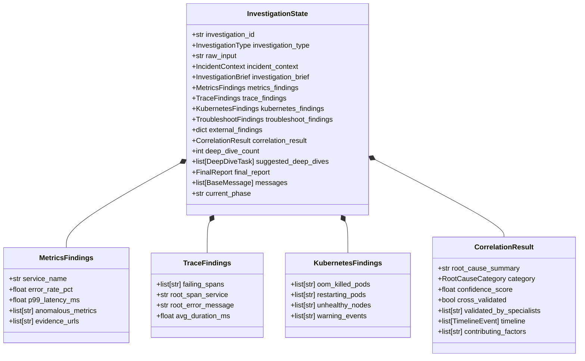
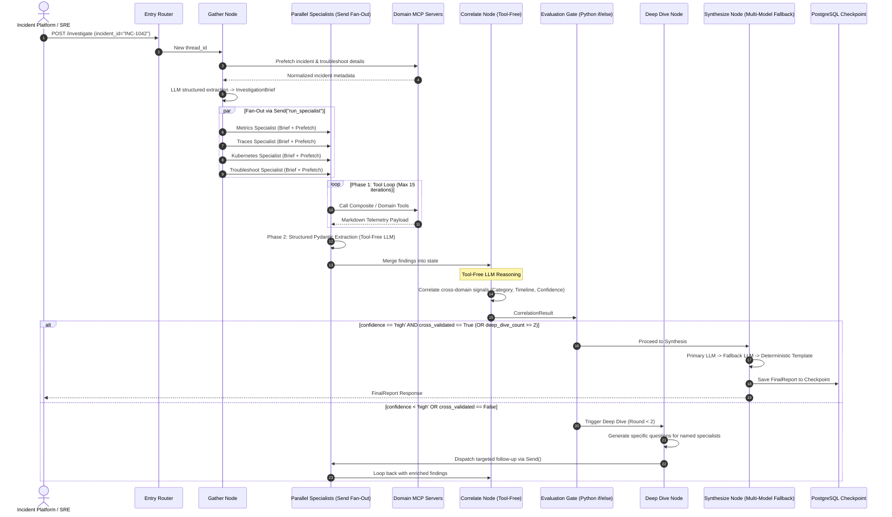
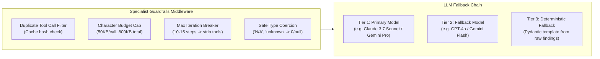

# Low-Level Architecture & Technical Specification

## 1. LangGraph State Schema & Reducers

LangGraph state is shared across parallel nodes via custom reducers to prevent `InvalidUpdateError` during parallel fan-out (`Send()`).



### LangGraph State Reducer Definition

```python
from typing import Annotated, TypedDict
from langchain_core.messages import BaseMessage
from langgraph.graph.message import add_messages

def last_non_none(current: any, update: any) -> any:
    """Last-writer-wins reducer for parallel specialist state keys."""
    return update if update is not None else current

class InvestigationState(TypedDict):
    investigation_id: str
    investigation_type: str
    incident_context: Annotated[dict | None, last_non_none]
    investigation_brief: Annotated[dict | None, last_non_none]
    metrics_findings: Annotated[dict | None, last_non_none]
    trace_findings: Annotated[dict | None, last_non_none]
    kubernetes_findings: Annotated[dict | None, last_non_none]
    troubleshoot_findings: Annotated[dict | None, last_non_none]
    external_findings: Annotated[dict, last_non_none]
    correlation_result: Annotated[dict | None, last_non_none]
    deep_dive_count: Annotated[int, last_non_none]
    suggested_deep_dives: Annotated[list[dict], last_non_none]
    final_report: Annotated[dict | None, last_non_none]
    messages: Annotated[list[BaseMessage], add_messages]
    current_phase: Annotated[str, last_non_none]
```

---

## 2. Detailed Execution Sequence & Node Logic



---

## 3. Production Hardening Mechanisms



1. **Duplicate Tool Call Filter:** Computes SHA-256 of `(tool_name, sorted_json_args)`. If re-issued, immediately returns: `"Error: Duplicate call suppressed. Refer to prior result."`
2. **Character Budget:** Per-result cap of 50,000 characters; cumulative session cap of 800,000 characters. When exceeded, tool bindings are removed, forcing immediate conclusion.
3. **Safe Coercion Validators:** Pydantic models use `@field_validator(mode="before")` on float/integer fields to safely map `"<UNKNOWN>"`, `"-"`, `"N/A"` to `0` or `None`.
4. **Three-Way Race Cancellation:** Every async node execution races against an `asyncio.Event` triggered by user cancellation or wall-clock timeouts.
